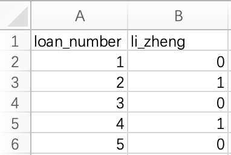

```{r setup, include=FALSE}
knitr::opts_chunk$set(echo = TRUE)
```


```{r, load_libraries, include = FALSE}
library(tidyverse) # the usual stuff: dplyr, readr, and other goodies
library(lubridate) # to handle dates
library(GGally) # for correlation-scatter plot matrix
library(ggfortify) # to produce residual diagnostic plots
library(rsample) # to split dataframe in training- & testing sets
library(janitor) # clean_names()
library(broom) # use broom:augment() to get tidy table with regression output, residuals, etc
library(huxtable) # to get summary table of all models produced
library(caret) # to train more advanced models (k-fold cross-validation, stepwise regression, LASSO)
library(nnet) # to calculate the maximum value of a vector
library(pROC) # to plot ROC curves
library(MLmetrics) #for caret LASSO logistic regression

```


# Introduction

Welcome to the second workshop. We will continue working with the lending club data. In this workshop we will take the perspective of an investor to the lending club. Our goal is to select a subset of the most promising loans to invest in. We will do so using the method of logistic regression. Feel free to consult the R markdown file of session 4.

For this workshop please submit a knitted (html) rmd file and a csv file containing your investment choices (see question 14) by the deadline posted on canvas. 25% of your grade will depend on the performance of your investment choices (i.e., question 14). The rest of the questions are equally weighted. 

In answering the questions below be succinct but provide complete answers with quantitative evidence as far as possible. Feel free to discuss methods with each other and with the tutors during the workshop. As this is an individual assignment, *do not collaborate* in answering the questions below or in making investment choices. 

After you have submitted your report I will upload a screencast that discusses the performance of your chosen portfolios. I will also use this screencast to illustrate the "wisdom of the crowd" principle. So please make sure you watch it.

Enjoy the workshop!

## Load the data

First we need to start by loading the data.
```{r, load_data, warning=FALSE, message=FALSE}

lc_raw <- read_csv("LendingClub Data.csv",  skip=1) %>%  #since the first row is a title we want to skip it. 
  clean_names() # use janitor::clean_names()
```

# ICE the data: Inspect, Clean, Explore

Any data science engagement starts with ICE. Inspecting, Clean and Explore the data. 

## Inspect the data

Inspect the data to understand what different variables mean. Variable definitions can be found in the excel version of the data.
```{r, Inspect}
glimpse(lc_raw)
```

## Clean the data
Are there any redundant columns and rows? Are all the variables in the correct format (e.g., numeric, factor, date)? Lets fix it. 

The variable "loan_status" contains information as to whether the loan has been repaid or charged off (i.e., defaulted). Let's create a binary factor variable for this. This variable will be the focus of this workshop.

```{r, clean data}
lc_clean<- lc_raw %>%
  dplyr::select(-x20:-x80) %>% #delete empty columns
  filter(!is.na(int_rate)) %>%   #delete empty rows
  mutate(
    issue_d = mdy(issue_d),  # lubridate::mdy() to fix date format
    term = factor(term_months),     # turn 'term' into a categorical variable
    delinq_2yrs = factor(delinq_2yrs) # turn 'delinq_2yrs' into a categorical variable
  ) %>% 
  mutate(default = dplyr::recode(loan_status, 
                      "Charged Off" = "1", 
                      "Fully Paid" = "0"))%>%
    mutate(default = as.factor(default)) %>%
  dplyr::select(-emp_title,-installment, -term_months, everything()) #move some not-so-important variables to the end. 
    
```

## Explore the data

Let's explore loan defaults by creating different visualizations. We start with examining how prevalent defaults are, whether the default rate changes by loan grade or number of delinquencies, and a couple of scatter plots of defaults against loan amount and income.


```{r, visualization of defaults, warning=FALSE}
#bar chart of defaults
def_vis1<-ggplot(data=lc_clean, aes(x=default)) +
  geom_bar(aes(y = (..count..)/sum(..count..))) + 
  labs(x="Default, 1=Yes, 0=No", y="relative frequencies") +
  scale_y_continuous(labels=scales::percent) +
  geom_text(aes( label = scales::percent((..count..)/sum(..count..) ),y=(..count..)/sum(..count..) ), stat= "count",vjust=-0.5) 
def_vis1


#bar chart of defaults per loan grade
def_vis2<-ggplot(data=lc_clean, aes(x=default), group=grade) +
  geom_bar(aes(y = (..count..)/sum(..count..), fill = factor(..x..)), stat="count")  +
  labs(title="Defaults by Grade", x="Default, 1=Yes, 0=No", y="relative frequencies") +
  scale_y_continuous(labels=scales::percent) +facet_grid(~grade) + theme(legend.position = "none") +
  geom_text(aes( label = scales::percent((..count..)/sum(..count..) ),y=(..count..)/sum(..count..) ), stat= "count",vjust=-0.5) 
def_vis2

#bar chart of defaults per number of Delinquencies
def_vis3<-lc_clean %>%
  filter(as.numeric(delinq_2yrs)<4) %>%
  ggplot(aes(x=default), group=delinq_2yrs) +
  geom_bar(aes(y = (..count..)/sum(..count..), fill = factor(..x..)), stat="count")  +
  labs(title="Defaults by Number of Delinquencies", x="Default, 1=Yes, 0=No", y="relative frequencies")  +
  scale_y_continuous(labels=scales::percent) +facet_grid(~delinq_2yrs) +
  theme(legend.position = "none") +
  geom_text(aes( label = scales::percent((..count..)/sum(..count..) ),y=(..count..)/sum(..count..) ), stat= "count",vjust=-0.5)

def_vis3

#scatter plots 

#We select 2000 random loans to display only to make the display less busy. 
set.seed(1234)
reduced<-lc_clean[sample(0:nrow(lc_clean), 2000, replace = FALSE),]%>%
  mutate(default=as.numeric(default)-1) # also convert default to a numeric {0,1} to make it easier to plot.

          
# scatter plot of defaults against loan amount                         
def_vis4<-ggplot(data=reduced, aes(y=default,x=I(loan_amnt/1000)))  + labs(y="Default, 1=Yes, 0=No", x="Loan Amnt (1000 $)") +geom_jitter(width=0, height=0.05, alpha=0.7) #We use jitter to offset the display of defaults/non-defaults to make the data easier to interpert. We have also changed the amount to 1000$ to reduce the number of zeros on the horizontal axis.

def_vis4

#scatter plot of defaults against loan amount.
def_vis5<-ggplot(data=reduced, aes(y=default,x=I(annual_inc/1000)))   + labs(y="Default, 1=Yes, 0=No", x="Annual Income(1000 $)") +geom_jitter(width=0, height=0.05, alpha=0.7) +  xlim(0,400)

def_vis5

```

We can also estimate a correlation table between defaults and other continuous variables.

```{r, correlation table, warning=FALSE, message=FALSE}

# correlation table using GGally::ggcor()
# this takes a while to plot

lc_clean %>% 
    mutate(default=as.numeric(default)-1)%>%
  select(loan_amnt, dti, annual_inc, default) %>% #keep Y variable last
 ggcorr(method = c("pairwise", "pearson"), label_round=2, label = TRUE)

```


> Q1. Add two more visualizations of your own. Describe what they show and what you learn from them in 1-2 lines. 

 
Insert your code here:
```{r}
# My visualization
```
Insert comments here: 

# Linear vs. logistic regression for binary response variables

It is certainly possible to use the OLS approach to find the line that minimizes the sum of square errors when the dependent variable is binary (i.e., default no default). In this case, the predicted values take the interpretation of a probability. We can also estimate a logistic regression instead. We do both below.


```{r, linear and logisitc regression with binary response variable, warning=FALSE}

model_lm<-lm(as.numeric(default)~I(annual_inc/1000), lc_clean)
summary(model_lm)


logistic1<-glm(default~I(annual_inc/1000), family="binomial", lc_clean)
summary(logistic1)


ggplot(data=reduced, aes(x=I(annual_inc/1000), y=default)) +
  geom_smooth(method="lm", se=0, aes(color="OLS"))+
  geom_smooth(method = "glm", method.args = list(family = "binomial"),  se=0, aes(color="Logistic"))+ labs(y="Prob of Default", x="Annual Income(1000 $)")+
  xlim(0,450)+scale_y_continuous(labels=scales::percent)+geom_jitter(width=0, height=0.05, alpha=0.7) +
  scale_colour_manual(name="Fitted Model", values=c("blue", "red"))


```

> Q2. Which model is more suitable for predicting probability of default, the linear regression or the logistic? Why? 

Answer here: 

# Multivariate logistic regression

We can estimate logistic regression with multiple explanatory variables as well. Let's use annual_inc, term, grade, and loan amount as features. Let's call this model logistic 2.

```{r, multivariate logistic regression, warning=False}
logistic2<-glm(default~I(annual_inc/1000) + term + grade + loan_amnt, family="binomial", lc_clean)

summary(logistic2)

#compare the fit of logistic 1 and logistic 2
anova(logistic1,logistic2)

```

> Q3. Based on logistic 2, explain the following:
a. Estimated Coefficient
b. Standard error of coefficient
c. p-value of coefficient
d. Deviance
e. AIC
f. Null Deviance
g. Is Logistic 2 a better model than logistic 1? Why or why not? 

Answer here:

>Q4. Calculate the predicted probabilities associated with logistic 2 and plot them as a density chart. Also plot the density of the predictions for those loans that did default, and for the loans that did not (on the same chart).

Insert your code here:
```{r}
#Predict the probability of default
prob_default2<- fitted.values(logistic2)
lc_clean$fitted = prob_default2

#plot 1: Density of predictions
lc_clean %>% 
  ggplot(aes(x=prob_default2,colour=default))+
  geom_density()

#plot 2: Density of predictions by default


```

## From probability to classification

The logistic regression model gives us a sense of how likely defaults are; it gives us a probability estimate. To convert this into a prediction, we need to choose a cutoff probability and classify every loan with a predicted probability of default above the cutoff as a prediction of default (and as a prediction of non-default for loans with a predicted probability below this cutoff).

Let's choose a threshold of 20%. Of course some of our predictions will turn out to be right but some will turn out to be wrong -- you can see this in the density figures of the previous section. Let's call "default" the "positive" class since this is the class we are trying to predict. We could be making two types of mistakes. False positives (i.e., predict that a loan will default when it will not) and false negatives (I.e., predict that a loan will not default when it will). These errors are summarized in the confusion matrix. 

>Q5. Produce the confusion matrix for the model logistic 2 for a cutoff of 16%

Insert your code here:
```{r, From probability to classification}
  
#Call any loan with probability more than 16% as defualt and any loan with lower probability as non-default. Make sure your prediction is a factor with the same levels as the default variable in the lc_clean data frame
p_class<- factor(if_else(prob_default2>0.16,1,0))
  
#produce the confusion matrix and set default as the positive outcome
con2<- confusionMatrix(lc_clean$default,p_class)

#print the confusion matrix
con2


```

>Q6. Using the confusion matrix, explain the following and show how they are calculated
a. Accuracy
b. Sensitivity
c. Specificity
For each of these explain what they mean in the context of the lending club and the goal of predicting loan defaults.

Answer here:

>Q7. Using the model logistic 2 produce the ROC curve and calculate the AUC measure. Explain what the ROC shows and what the AUC measure means. Why do we expect the AUC of any predictive model to be between 0.5 and 1? Could the AUC ever be below 0.5 or above 1? 

Insert your code here:
```{r, ROC curves, warning=FALSE}
#estimate the ROC curve for Logistic 2
ROC_logistic2 <-

#estimate the AUC for Logistic 2 and round it to two decimal places
AUC2<-  
#Plot the ROC curve and display the AUC in the title
ROC2<-

ROC2
```
Provide comments here: 


>Q8. So far we have only worked in-sample. Split the data into training and testing and estimate the models ROC curve and AUC measure out of sample. Is there any evidence of over fitting?

Insert your code here::
```{r, out-of-sample ROC curve}
# splitting the data into training and testing
set.seed(1234)
train_test_split <- initial_split(lc_clean, prop = 0.7)
testing <- testing(train_test_split) #20% of the data is set aside for testing
training <- training(train_test_split) #80% of the data is set aside for training

# run logistic 2 on the training set 
logistic2<-

#calculate probability of default in the training sample 
p_in<-
  
#ROC curve using in-sample predictions
ROC_logistic2_in <- 
#AUC using in-sample predictions
AUC_logistic2_in<-
  
#calculate probability of default out of sample 
p_out<

#ROC curve using out-of-sample predictions
ROC_logistic2_out <- 
#AUC using out-of-sample predictions
AUC_logistic2_out <- 
#plot in the same figure both ROC curves and print the AUC of both curves in the title

```
Provide comments here: 


## Selecting loans to invest in using the model Logistic 2.

Before we look for a better model than logistic 2 let's see how we can use this model to select loans to invest in. Let's make the simplistic assumption that every loan generates \$25 profit if it is paid off and \$90 loss if it is charged off for an investor. Let’s use a cut-off value to determine which loans to invest in, that is, if the predicted probability of default for a loan is below this value then we invest in that loan and not if it is above. 

To do this we split the data in three parts: training, validation, and testing. Feel free to experiment with different seeds but please use the seeds provided below for your submission.

```{r}
# splitting the data into training and testing
set.seed(1234)
train_test_split <- initial_split(lc_clean, prop = 0.6)
training <- training(train_test_split) #60% of the data is set aside for training
remaining <- testing(train_test_split) #40% of the data is set aside for validation & testing
set.seed(4321)
train_test_split <- initial_split(remaining, prop = 0.5)
validation<-training(train_test_split) #50% of the remaining data (20% of total data) will be used for validation
testing<-testing(train_test_split) #50% of the remaining data (20% of total data) will be used for testing
```


>Q9. Train logistic 2 on the training set above. Use the trained model to determine the optimal cut-off threshold based on the validation test. What is the optimal cutoff threshold? How much profit does it generate? Using the testing set, what is the profit per loan associated with the cutoff? 

Insert your code here:
```{r}

```
Insert your comments here:

# More realistic revenue model

Let’s build a more realistic profit and loss model. Each loan has different terms (e.g., different interest rate and different duration) and therefore a different return if fully paid. For example, a 36 month loan of \$5000 with installment of \$163 per month would generate a return of `163*36/5000-1` if there was no default. Let’s assume that it would generate a loss of -70% if there was a default (the loss is not 100% because the loan may not default immediately and/or the lending club may be able to recover part of the loan). 

>Q10. Under these assumptions, how much return would you get if you invested \$1 in each loan in the validation set? Express your answer as a % return.

Insert your code here:
```{r}
```
Insert comments here:

Unfortunately, we cannot use the realized return to select loans to invest in (as at the time we make the investment decision we do not know which loan will default). Instead, we can calculate an expected return using the estimated probabilities of default -- expected return = return if not default * (1-prob(default)) + return if default * prob(default). 


> Q11. Calculate the expected return of the loans in the validation set using the logistic 2 model trained in the training set. Can you use the expected return metric to select a portfolio of the $n$ most promising loans to invest in ($n$ is an integer number)? How does the realized return vary as you change $n$? What is the profit for $n=800$? 

Insert your code here:
```{r}
```
Insert comments here:

>Q12. For $n=800$, how sensitive is your answer to the assumption that if a loan defaults you lose 70% of the value? To answer this question assess how the realized return of the 800 loans chosen in your portfolio changes if the loss proportion varies from 20%-80%?

Insert your code here:
```{r}
```
Insert comments here:

>Q13. Experiment with different models using more features, interactions, and non-linear transformations. You may also want to try to estimate models using regularization (e.g., LASSO regression). Feel free to use data from other sources but make sure your model does not use information that would not be available at the time the loan is extended (e.g., for a 4-year loan given in January 2008, you can't use macro-economic indicators for 2008 or 2009 to predict whether the loan will default). Present below your best model ONLY and explain why you have chosen it (at the very least comment on AUC of your model against other models, e.g. logistic 2. Even better if you can compare your new model against logistic 2 on the realized return of 800 loans chosen out-of-sample from a data set of similar size to the validation set above.)

Insert your code here:
```{r}
```
Insert comments here:

>Q14 For this question you will not need to use the Lending Club dataset. Suppose you are helping a government authority to decide what type of Covid-19 rapid virus detection tests to use across the country for nursing home residents and for daily wage construction site workers, for regular periodic testing. Nursing home residents are elderly retired individuals and often have ailments like diabetes or asthma which result in worse illness and higher risk of death, if they get Covid-19. On the other hand, daily wage construction workers have an average age of 35 and are relatively healthy. They are often the only earning member in their household, and they typically do not have savings that they can draw from in times of need. Three rapid tests  are available, which vary in their sensitivity and specificity. Test A has high specificity and low sensitivity while test B has low specificity and high sensitivity. Test C has medium specificity and medium sensitivity. You need to pick a single test for use in nursing homes, and a single (possibly the same) test for use at construction sites. The tests will be offered free of cost. Which test(s) would you pick, and why? State any assumptions. 

>You have been asked to assess whether, for select individuals in each subpopulation (nursing homes and construction sites), it would be better if they could be given a different test from the one you recommended above for their subpopulation. If you could gather additional features related to the individuals in these two populations to support your argument, list 3 features you would gather, and why. State any assumptions.
 

Answer here:


>Q15. The file "Assessment Data_2021.csv" contains information on almost 1800 new loans. Use your best model (see previous question) to choose 200 loans to invest in. For this question assume that the loss proportion is 70%. Your grade on this question will be based on the actual performance of your choices.

The submitted output should be a csv file "firstname_lastname.csv" containing only two columns: column A should have the loan number. Column B should have your name on top and then the number 1 for loans you would like to invest in and number zero otherwise. For example, if “Li Zheng” wanted to invest in loans 2 and 4 but not in loans 1, 3, or 5, her submission should be named "li_zheng.csv" and if opened in Excel should look like this:



(If you can't see the picture make sure you download it from canvas in your working directory.)


Please follow these instructions closely. *Do not change the order of the loans. Do not submit a list of only the loan numbers you would invest in. For loans you do not want to invest in, you should write “0” or leave the cell empty. Do not invest in more (or fewer) than 200 loans. Make sure the loan numbers are in column A and the choices in column B, start in cell A1, don’t forget to add your name.* Before you submit, open your file in EXCEL to make sure it looks like the sample above. Also check that the file size is not more that a few kilobytes. If it's more you are doing something wrong.*

Add to the code below to do this:
```{r}
lc_assessment<- read_csv("Assessment Data_2021.csv") %>%  #load the data 
  clean_names() %>% # use janitor::clean_names() 
  mutate(
    issue_d = mdy(issue_d),  # lubridate::mdy() to fix date format
    term = factor(term_months),     # turn 'term' into a categorical variable
    delinq_2yrs = factor(delinq_2yrs)) # turn 'delinq_2yrs' into a categorical variable


```

After you have submitted your report I will upload a screencast that discusses the performance of your chosen portfolios. I will also use this screencast to illustrate the "wisdom of the crowd" principle. So please make sure you watch it.

# Critique

No data science engagement is perfect. Before finishing a project it is always important to reflect on the limitations of the analysis and suggest ways for future improvement.

> Q16. Provide a critique of your work. What would you want to add to this analysis before you use it in practice? 

Insert comments here:

>Q17. In our analysis we did not use information about the applicants' race or gender. Why do you think this is the case? Should we have done so? 


Insert comments here:


Please submit an html knitted version of your rmd file. Before you submit, please check that the file has knitted correctly and it is not too large (e.g., you are not printing the whole data set or all your investment choices!). Also, please submit on time -- delayed submissions will be penalized according to the course policy. 


